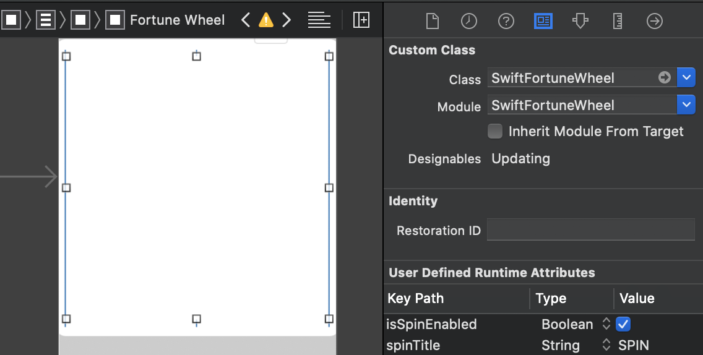
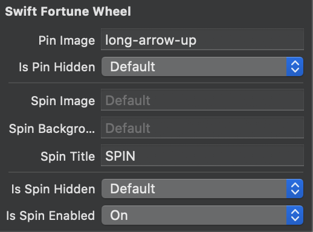
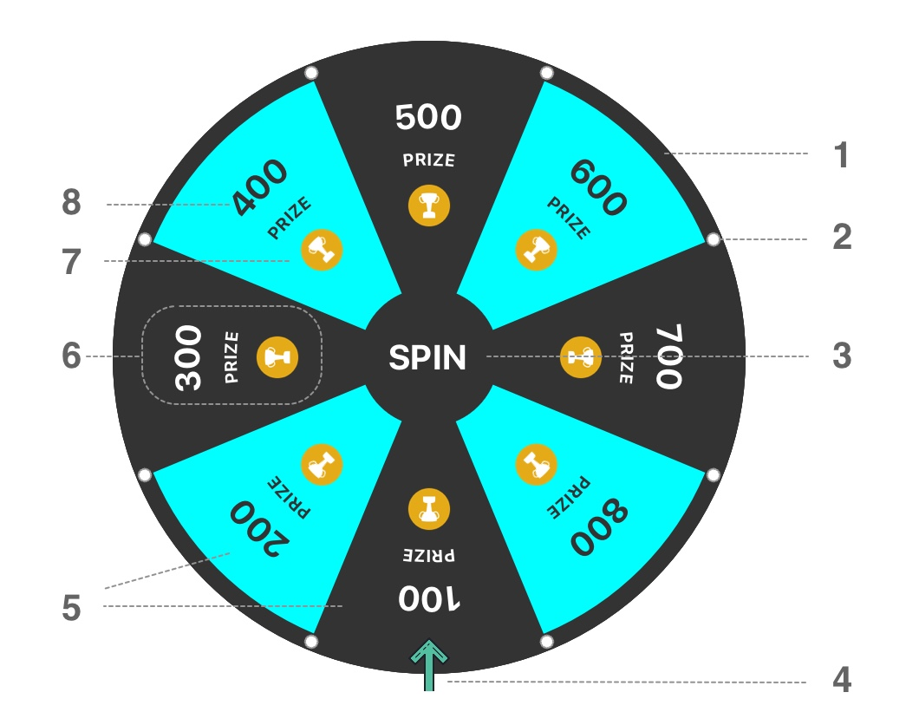

# Getting Started
- [**How to use**](#how—to-use)
- [**Visual diagram**](#visual—diagram)
- [**Necessarily note**](#necessarily—note)

## How to use

- Import **SwiftFortuneWheel** to your ViewController class:

``` Swift
import SwiftFortuneWheel
```

- Add `UIView` to Storyboard's ViewController. Change class and module to `SwiftFortuneWheel` and @IBOutlet to your ViewController:



> _Make sure that your `SwiftFortuneWheel` view has 1:1 aspect ratio._

- Change basic preferences in you Interface Builder:




``` Swift
/// Fortune Wheel
@IBOutlet weak var fortuneWheel: SwiftFortuneWheel!
```

- Create slice content list:

``` Swift
var slices: [Slice] = []
let imagePreferences = ImagePreferences(preferredSize: CGSize(width: 40, height: 40), verticalOffset: 40)
let imageSliceContent = Slice.ContentType.image(name: "crown", preferenes: imagePreferences)
let slice = Slice(contents: [imageSliceContent])
slices.append(slice)
```

- Create a `SwiftFortuneWheel` configuration:


``` Swift
let configuration: SwiftFortuneWheelConfiguration = .myWheelConfiguration
```

> _For detail information, how to create a configuration object, please see a **SwiftFortuneWheelDemoiOS** project,  `SwiftFortuneWheelConfiguration+Example.swift` file._

- Pass slices and configuration to the `SwiftFortuneWheel`:

``` Swift
fortuneWheel.configuration = configuration
fortuneWheel.slices = slices
```

- To start spin animation:

``` Swift
fortuneWheel.startAnimating(fullRotationTimeInSeconds: 1, finishIndex: 0) { (finished) in
            print(finished)
        }
```

</br>

## Visual diagram



1. **`WheelView`** (configures with `WheelPrefereces`)

2. **`SwiftFortuneWheelConfiguration.AnchorImage`**, optional

3. **`SpinButton`** (configures with `SpinButtonPreferences`)

4. **`PinImageView`** (configures with `PinImageViewPreferences`). `PinImageView` could be set to hidden, however, `PinImageViewPreferences` with the `Position` is required to be set properly in configuration.

5. **`Slice`** (configures with `SlicePreferences`)

6. List of **`Slice.ContentType`**

7. **`Slice.ContentType.image`** (configures with `ImagePreferences`)

8. **`Slice.ContentType.text`** (configures with `TextPreferences`)


> _All `Preference`, expect `ImagePreferences` and `TextPreferences`, are part of `SwiftFortuneWheelConfiguration`._

</br>

## Necessarily note

> _Please note that in order to properly draw objects, `SwiftFortuneWheel` is rellies on `SwiftFortuneWheelConfiguration`. It’s up to you how to configure but without configuration, `SwiftFortuneWheel` won’t work properly._


