

The ultimate spinning wheel control that supports dynamic content and rich customization.

| | Main Features |
|---|---|
| 🏵 | Dynamic content, supports texts, images, and lines |
| 🎯 | Adaptive text size with support multiline, alignment and line break mode |
| 🎇 | Supports background Image for each Slice (sector) |
| 🧮 | Supports vertical and horizontal text orientation |
| 🌈 | Appearance customization |
| 🔊 | Sounds and haptic feedback |
| 🌋 | Collision callbacks and effects |
| 🎨 | Drawn and animated using CoreGraphics, CoreAnimations |
| 🔋 | High performance, low memory usage |

### Layout Preview

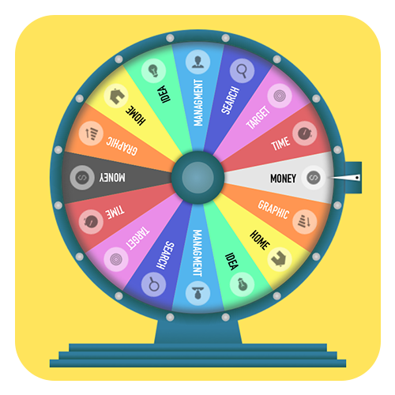

> _Taken from [example projects](/Examples)_

### Dynamic Content and Rotation Preview

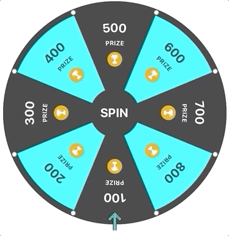

> _Taken from [example projects](/Examples)_

### Collision Effect Preview

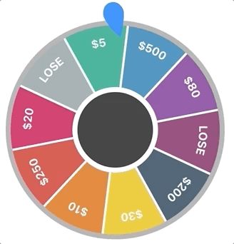

> _Taken from [example projects](/Examples)_

## Screenshots

  
from iOS Example Project

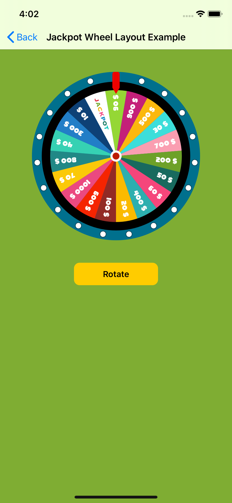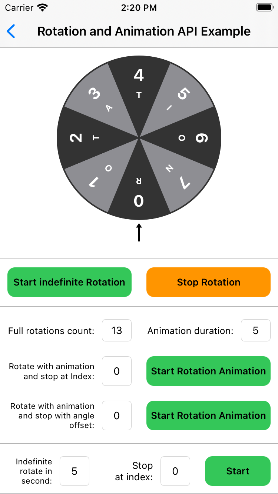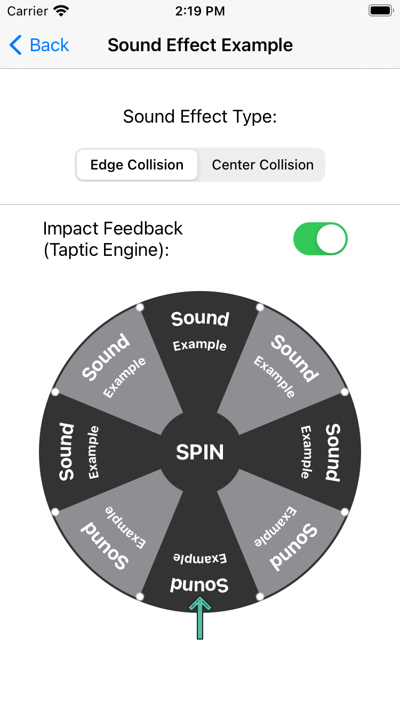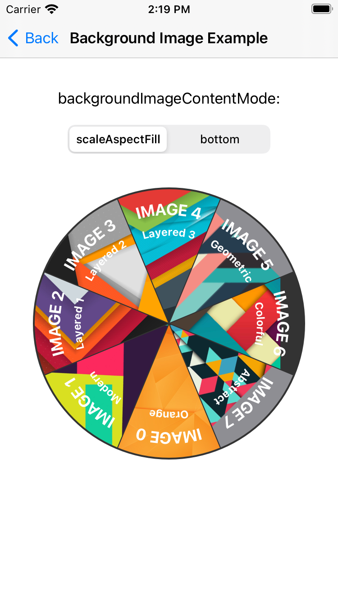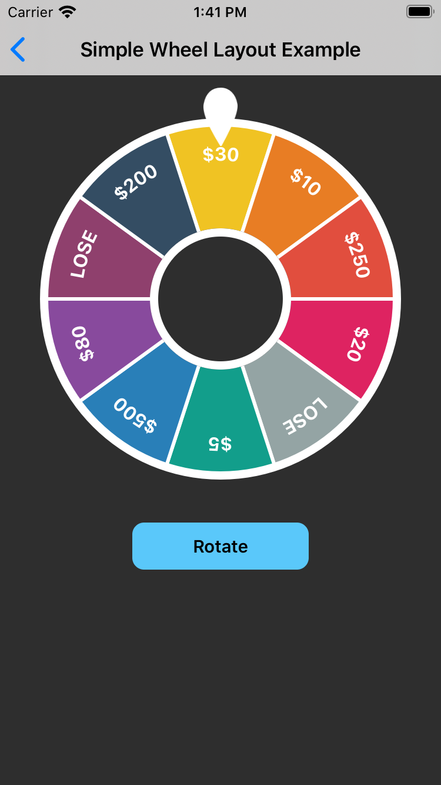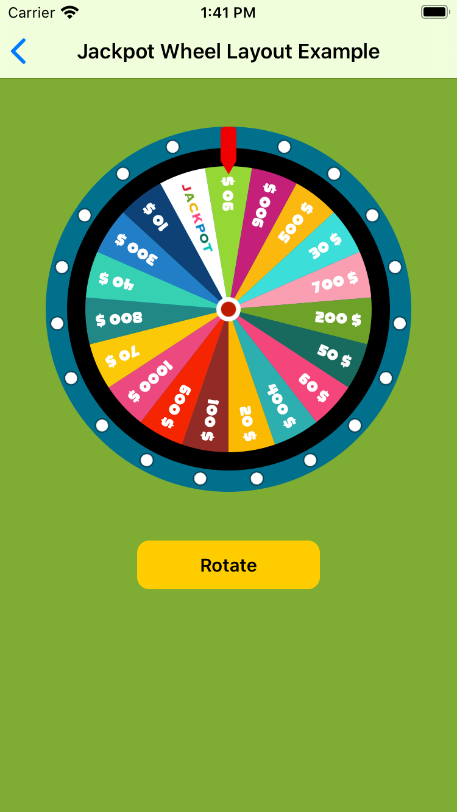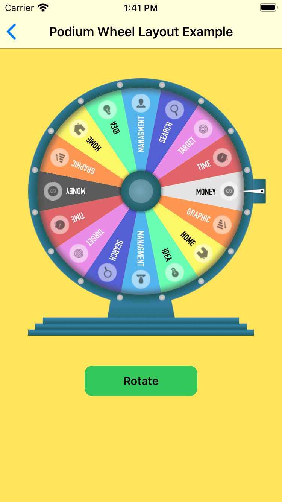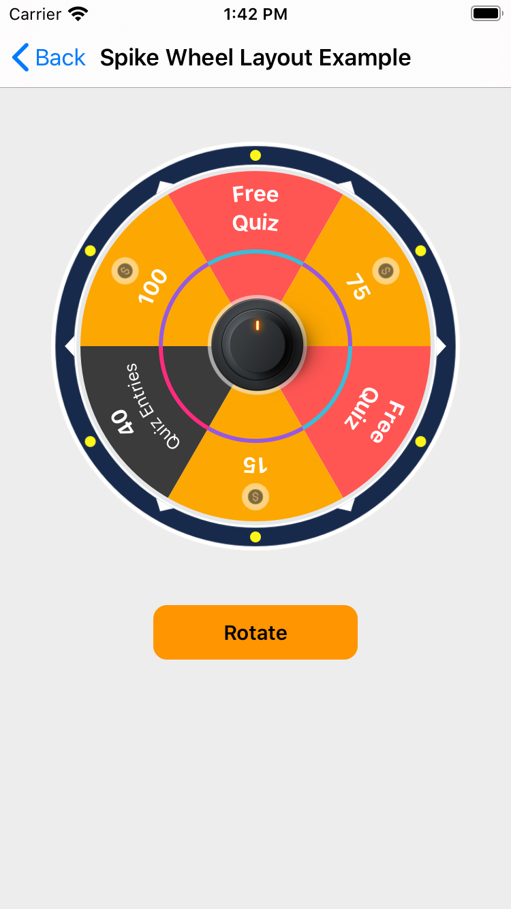

- - -

  
from macOS Example Project

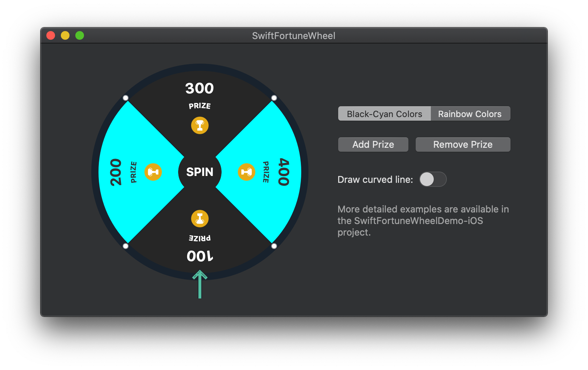

- - -

  
from tvOS Example Project

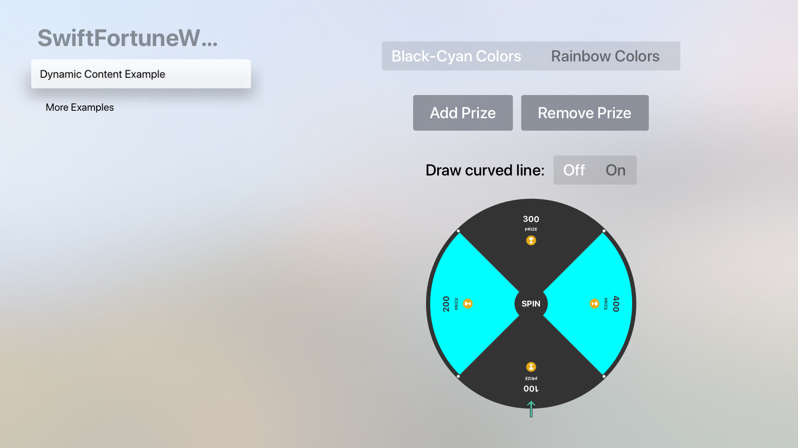

- - -

## Documentation

- [**Getting Started Guide**](/Documentation/GettingStarted.md)
- [**API Overview**](/Documentation/API_Overview.md)
- [**Configuration In-Depth**](/Documentation/Configuration_indepth.md)
- [**About Slice and Slice’s contents**](/Documentation/About_Slice_and_Slice_contents.md)
- [**Sound Effects and Impact Feedback**](/Documentation/sound_effects.md)
- [**pinImageView Collision effect and Collision Callbacks**](/Documentation/collision.md)
- [**About Port to Other Platforms**](/Documentation/Port_to_Other_Platforms.md)
- [**Example Projects**](/Examples)
## Installation

When you are ready to install, follow the [**Installation Guide**](/Documentation/Installation.md).

## API Documentation

You can find <a href="https://sh-khashimov.github.io/SwiftFortuneWheel/" target="_blank">**the docs here**</a>. 

Documentation is generated with [jazzy](https://github.com/realm/jazzy) and hosted on [GitHub-Pages](https://pages.github.com/).

## Requirements

| App name | Swif | Xcode | Platforms |
|---|---|---|---|
| 1.1.x - current version | Swift 5.0 | Xcode 11 | iOS 9.0 / macOS 10.11 / tvOS 9.0 |
| 0.x.x - 1.0.x | Swift 5.0 | Xcode 11 | iOS 9.0 |

## Contributing
Pull requests are welcome. For major changes, please open an issue first to discuss what you would like to change.

Please make sure to update tests as appropriate.

## Migration

- [**from 1.1.x to 1.2.x**](/Documentation/Migrations/Migration_1.1.x_to_1.2.x.md)
- [**from 1.0.x to 1.1.x**](/Documentation/Migrations/Migration_1_to_1.x.md)
- [**from 0.x.x to 1.0.0**](/Documentation/Migrations/Migration_0_to_1.md)

## Changelog

See [**changelog here**](/Documentation/Changelog.md)

## Author

Sherzod Khashimov

## License
[MIT](https://choosealicense.com/licenses/mit/)